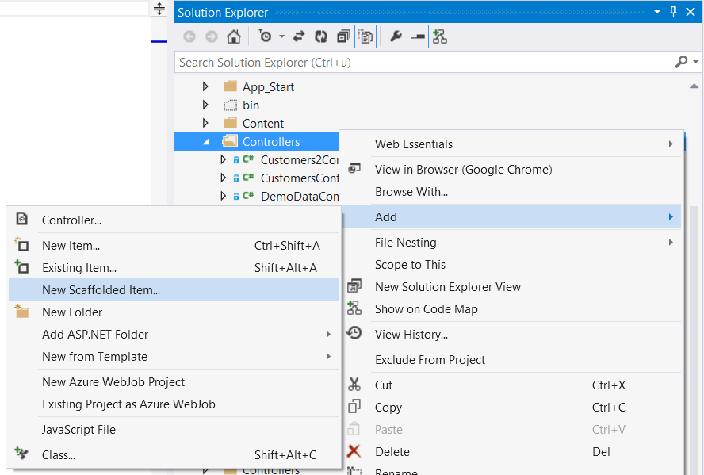
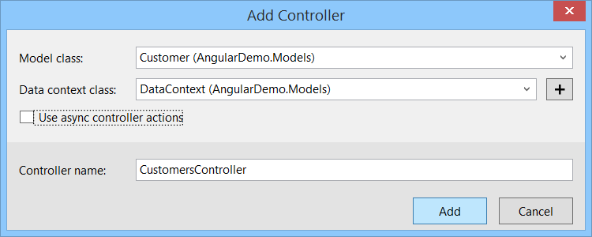
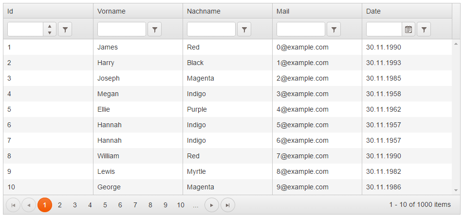
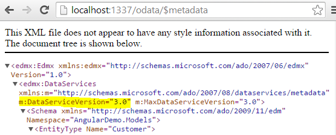

# Optimale Web-Umgebung mit AngularJS und ASP.NET, Teil 2
## Gute Kommunikation

### AngularJS und der Microsoft Web Stack ergänzen sich ideal. Lernen Sie in dieser Artikelreihe eine Auswahl von Patterns und Frameworks kennen, welche Sie bei der Adaption und Integration von AngularJS in Ihre .NET-Anwendung berücksichtigen sollten. 

In einer typischen ASP.NET MVC oder Web Forms Anwendung kann es leicht geschehen, dass eine saubere Trennung von Daten und Layout verloren geht. Setzt man auf eine Single-Page-Anwendung, so hat man die Gelegenheit den Datenfluss zu überdenken und neu zu definieren. Es bietet sich eine Architektur nach dem **Re**presentational **S**tate **T**ransfer (REST [1]) an. Doch hinsichtlich der einzusetzenden Protokolle, Formate und Konventionen bleiben diverse Fragen für die praktische Umsetzung von REST offen. Wie sollen etwa die Query-Parameter heißen? Welchem Format soll eine Antwort genügen? Wie lassen sich die Schnittstellen maschinenlesbar definieren? Microsoft gibt hier mit dem Open Data Protocol (OData) eine ausführliche und standardisierte Antwort.

#### Die Geschäftslogik

Alle Beispiele in diesem Artikel beziehen sich auf einer simplen Geschäftslogik. Die technische Grundlage stellt das Entity Frameworks Version 6. Es wird der "Code First"-Ansatz verwendet. Die vom Entity Framework erzeugten Instanzen sollen auch gleichzeitig die Geschäftsobjekte repräsentieren. Bitte beachten Sie, dass die feste Verdrahtung der Geschäftslogik mit einem Objektrelationen Mapper wie dem Entity Framework für eine größere Anwendung sorgfältig geprüft sein sollte! Für eine Beispiel-Anwendung ist dies aber kein Problem. Es gibt somit die Entität "Kunde", welche eine beliebige Anzahl an Rechnungen besitzen kann.

##### Listing 1a -- Die "Geschäftslogik"
~~~~~
public class Customer
{
    public Customer()
    {
        Invoices = new List<Invoice>();
    }

    public int Id { get; set; }
    public string FirstName { get; set; }
    public string LastName { get; set; }
    public string Mail { get; set; }
    public DateTime DateOfBirth { get; set; }
    public virtual ICollection<Invoice> Invoices { get; set; }
}

public class Invoice
{
    public int Id { get; set; }
    public decimal Amount { get; set; }

    public int CustomerId { get; set; }                     
    public virtual Customer Customer { get; set; } 
}

public class DataContext : DbContext, IDataContext
{
    public DbSet<Customer> Customers { get; set; }
    public DbSet<Invoice> Invoices { get; set; }

    protected override void OnModelCreating(DbModelBuilder modelBuilder)
    {
        modelBuilder.Configurations.Add(new InvoiceMap());
    }
}
~~~~~

#### Daten per Web API abrufen

Als erster Anwendungsfall soll eine Liste von Kunden angezeigt werden. Für diese häufig benötigte Aufgabe existiert sogar ein "Scaffolding" T4-Template in Visual Studio 2013. (Auswahl: "Web API 2 Controller with actions, using Entity Framework")

##### [Abb. 1] Scaffolding in Visual Studio 2013

##### [Abb. 1] Scaffolding in Visual Studio 2013

Visual Studio generiert dabei einen längeren Code, welcher per ASP.NET Web API den Entity Framework-Context zum Erzeugen, Lesen, Ändern und Löschen (CRUD) für die Außenwelt verfügbar macht. In einer an REST orientierten Schnittstelle kann man diese atomaren Operationen mit den HTTP-Verben POST, GET, PUT und DELETE ausdrücken. Folgender Aufruf gibt etwa eine Liste von Kunden zurück:

~~~~~
GET http://example.org/api/Customers
~~~~~  

Passende dazu zeigt der Ausschnitt aus Listing 1b die von Visual Studio generierte "READ"-Methode.

##### Listing 1b -- Web API Controller per generiertem Code (Ausschnitt)
~~~~~
public class CustomersController : ApiController
{
    private DataContext db = new DataContext();

    // GET: api/Customers
    public IQueryable<Customer> GetCustomers()
    {
        return db.Customers;
    }

    /* [...] */
}
~~~~~

Mit AngularJS  lässt sich dieser Web API Controller über den `$http`-Service aufrufen. Der Service akzeptiert einen String oder ein Konfigurations-Objekt. Der Rückgabewert der Methode ist ein "promise"-Objekt, welches die Methoden "success" und "error" besitzt. Über diese beiden Methoden lassen sich Callbacks für einen erfolgreichen bzw. fehlerhaften Aufruf registrieren. Das Listings 1c zeigt den vollständigen Code, um Daten per `$http` zu laden. 

##### Listing 1c -- AngularJS Controller fragt Daten per GET ab
~~~~~
define(['angular'], function(angular) {

    return angular.module('listing1', [])
        .controller('listing1Controller', [
            '$scope', '$http', function($scope, $http) {

                $scope.customers = [];

                $http.get('/api/Customers').success(function(data) {
                    $scope.customers = data;
                });
            }
        ]);
});
~~~~~ 

Der `define` Befehl wurde im letzten Artikel dieser Reihe erläutert (dotnetpro Ausgabe 01/2015). Mittels require.js werden Abhängigkeiten für das Modul definiert und angefordert. In diesem vorliegenden Fall existiert nur eine einzige Abhängigkeit zu AngularJS. Die empfangenen Daten werden anschließend mittels `ng-repeat` und dem CSS-Framework Bootstrap [2] tabellarisch dargestellt (siehe Listing 1d).

##### Listing 1d -- AngularJS Template rendert Daten als Tabelle
~~~~~

    <table class="table table-striped">
        <thead>
            <tr>
                <th>#</th>
                <th>FirstName</th>
                <th>LastName</th>
                <th>Mail</th>
            </tr>
        </thead>
        <tbody>
            <tr ng-repeat="customer in customers">
                <td ng-bind="customer.Id"></td>
                <td ng-bind="customer.FirstName"></td>
                <td ng-bind="customer.LastName"></td>
                <td></td>
            </tr>
        </tbody>
    </table>

~~~~~ 

##### [Abb. 2] Die Tabelle aus Listing 1d im Bootstrap-Design

#### Verwendung von OData zur Anzeige tabellarischer Daten

So wie der Web API Controller aus Listing 1b implementiert wurde, wird ein Aufruf der Ressource ohne weitere Parameter eine Liste aller Entitäten zurück geben. Es wird hierbei tatsächlich der gesamte Inhalt der Datenbank-Tabelle ausgeben! Je mehr Daten vorhanden sind, desto unbrauchbarer wird dieser Ansatz. Es fehlt eine seitenweise Einschränkung der Ergebnismenge. An diesem Punkt stellt sich die Frage, wie die notwendigen Query-Parameter in der URL benannt werden sollten. Man könnte etwa "page" und "pagesize" verwenden. Man könnte sich auch von LINQ inspirieren lassen und auf "skip" und "take" setzen. Man könnte aber auch einen HTTP Range-Header [3] setzen, um die Menge an Entitäten einzuschränken (Erläuterung siehe [4]).

Die Entscheidungsmatrix lässt sich beliebig weiterführen und auf weitere Probleme ausweiten. Klärungsbedarf innerhalb eines Teams sind vorprogrammiert. Eine zähe Entscheidungsfindung lässt sich gänzlich vermeiden, wenn man auf das OData Protokoll setzt. OData gibt die Namen der Parameter exakt vor, so dass die Verwendung eindeutig wird [5]. Die notwendigen Parameter heißen `$top` und `$skip`. `$top` gibt *n* Elemente der Ergebnismenge zurück. `$skip` überspringt *n* Elemente in der Ergebnismenge. Möchte man z.B. die Kunden mit der fortlaufenden Nummer 3 bis 7 abrufen, so verwendet man folgendes Query:

~~~~~
GET http://example.org/odata/Customers?$top=5&$skip=2
~~~~~

Weitere Query-Parameter sind unter anderem `$filter`, `$orderby`, `$count` oder `$search`. Der bestehende Web API Controller kann durch ein paar Änderungen um die Funktionalität von OData ergänzt werden. Der Controller muss hierzu vom ODataController erben. Weiterhin ist es notwendig, dass die Funktionalität per `[EnableQuery]` explizit freigeschaltet wird.    

##### Listing 2a -- OData Controller (Ausschnitt)
~~~~~
public class CustomersController : ODataController
{
    private DataContext db = new DataContext();

    // GET: odata/Customers
    [EnableQuery]
    public IQueryable<Customer> GetCustomers()
    {
        return db.Customers;
    }

    /* [...] */
}
~~~~~

Anschließend ist es notwendig die Klasse `WebApiConfig` zu konfigurieren. Mittels `config.Routes.MapODataRoute` legt man fest, unter welcher Adresse der "root" des OData Service zu finden ist. Alle Beispiele von Microsoft verwenden die Adresse "/odata", welche sich von der Adresse "/api" für normale ASP.NET Web API Aufrufe unterscheidet.  

##### Listing 2b -- OData konfigurieren
~~~~~
public static class WebApiConfig
{
    public static void Register(HttpConfiguration config)
    {
        ODataConventionModelBuilder builder = new ODataConventionModelBuilder();
        builder.EntitySet<Customer>("Customers");
        builder.EntitySet<Invoice>("Invoices");
        config.Routes.MapODataServiceRoute("odata", "odata", builder.GetEdmModel());
    }
}
~~~~~

Der Controller unterstützt nun eine seitenweise Ausgabe, Sortierung und Filterung. Diese Fähigkeiten direkt mit AngularJS umzusetzen wäre ein großer Aufwand. Es bietet sich an, ein fertiges Tabellen-Control ("Grid") zu verwenden. Hierfür gibt es eine Reihe von freien und proprietären Komponenten, die mit AngularJS kompatibel sind. Listing 2c und Listing 2d zeigen die Verwendung des Kendo UI Grids von Telerik [6].

##### Listing 2c -- AngularJS Controller konfiguriert die Datenquelle für OData
~~~~~
define(['angular', 'kendo'], function(angular) {

    return angular.module('listing2', ['kendo.directives'])
        .controller('listing2Controller', [
            '$scope', function($scope) {

                $scope.customerDataSource = new kendo.data.DataSource({
                    type: 'odata',
                    transport: {
                        read: {
                            type: 'GET',
                            url: '/odata/Customers',
                            dataType: 'json'
                        }
                    },
                    schema: {
                        data: function (data) { return data.value; },
                        total: function (data) { return data['odata.count']; },
                        model: {
                            id: 'Id',
                            fields: {
                                Id: { type: 'number' },
                                FirstName: { type: 'string' },
                                LastName: { type: 'string' },
                                Mail: { type: 'string' },
                                DateOfBirth: { type: 'date' }
                            }
                        }
                    },
                    serverPaging: true,
                    serverSorting: true,
                    serverFiltering: true,
                    pageSize: 10
                });
            }
        ]);
});
~~~~~

##### Listing 2d -- Eine AngularJS Direktive wrappt das KendoUI Grid-Control
~~~~~

~~~~~  

##### [Abb. 3] Das Kendo UI Grid

Im Kern ist Kendo UI ein Framework, welches aus diversen jQuery-Plugins besteht. Normalerweise ist die Integration von jQuery-Plugins in AngularJS mit etwas Aufwand verbunden. Doch der Hersteller liefert über das AngularJS Modul `kendo.directives` gleich passende Direktiven für AngularJS mit. Die Datenquelle "customerDataSource" beschreibt das Geschäftsmodell und die Fähigkeiten des OData Services im Detail. Um die Übersichtlichkeit zu erhöhen, wurde die Datenquelle nicht im Markup konfiguriert und könnte in einem nächsten Refactoring-Schritt z.B. in einen eigenen AngularJS Service ausgelagert werden. 

#### Metadaten in OData 

In einer Single Page Anwendung existiert üblicherweise viel Geschäftslogik direkt auf der Client-Seite. Doch auch der Server behält seine Bedeutung für die tatsächliche Persistenz der Daten und dem Anstoßen von Prozessen. Die Auswirkungen des Technologiewechsels zwischen Client und Server möchte man natürlich möglichst gering halten. Betrachtet man das Listing 1c erneut, so fallen unter diesem Aspekt einige unschöne Tatsachen auf. Zunächst muss man genau wissen, unter welcher Adresse Entitäten vom Typ Kunden zu finden sind. Das klingt trivial, aber je nach Geschmack kann dies z.B. "/api/Customer" oder "/api/Customer**s**" sein. Die Antwort des Web API Controllers ist zudem ein pures JSON-Dokument (siehe Listing 3).  

##### Listing 3 -- Antwort des Web API Controllers
~~~~~
[
  {
    "Id": 1,
    "FirstName": "James",
    "LastName": "Red",
    "Mail": "0@example.com",
    "DateOfBirth": "1990-11-30T12:04:53.853",
    "Invoices": []
  }, 
  { ...}
]
~~~~~

Das Geburtsdatum war in der C#-Welt noch vom Typ DateTime. In JSON wird das Datum als String repräsentiert da kein äquivalenter Datentyp existiert. Das spätere Property am JavaScript-Objekt bleibt leider ein simpler String. Ebenso existiert ein Property namens "Invoices". Ob sich darin wirklich Entitäten vom Typ "Rechnung" befinden und wie diese exakt beschaffen sind, ist für Nutzer der API reine Spekulation. Es fehlen offensichtlich Metadaten, welche die API genauer beschreiben.   

Laut Spezifikation sollte ein OData Service sein Modell im "Common Schema Definition Language" (CSDL) Format offen legen. In jenem CSDL-Dokument ist ein "Entity Data Model" (EDM) beschrieben [7]. Das "Entity Data Model" ist ein alter Bekannter, welcher seit jeher die konzeptionelle Grundlage des Entity Frameworks bildet. Es liegt nahe das bereits existierende Code-First-Modell aus dem Entity Framework wieder zu verwenden. Damit würde man aber das gesamte Datenbanklayout veröffentlichen. Ebenso könnte man den Service nicht mehr um zusätzliche Operationen ergänzen. Es ergibt sich daher die Notwendigkeit, ein zweites, öffentliches Modell zu erstellen. Hierfür verwendet man den ODataConventionModelBuilder, welcher in Listing 2b bereits verwendet wurde. Im Listing 2b wurde etwa die Entscheidung zum Plural gewählt ("Customer**s**" und "Invoice**s**"). Die Adresse des Metadaten-Dokument ist immer gleich. Die Adresse setzt sich zusammen aus der Root-Adresse des OData Service sowie dem Suffix "$metadata":

~~~~~
GET http://example.org/odata/$metadata
~~~~~

#### Daten der serverseitigen Geschäftslogik mit Breeze.js abfragen

Dank der ausführlichen Metadaten sowie der URL Konventionen lässt sich die Entwicklung eigener Funktionalitäten entscheidend vereinfachen. Der Einsatz der Low-Level API von `$http` wäre jedoch ein großer Aufwand. Auch das Angular-Modul `ngResource` ist kaum geeignet. Man benötigt ein Framework, welches die Komplexität von OData auf ein verständliches Niveau abstrahiert.

Die gesuchte technische Abstraktion bringt das Open-Source Framework "Breeze.js" [8], welches für die OData Integration auf "data.js" [9] zurückgreift.  Als ebenbürtiges Framework sollte "JayData" nicht unerwähnt bleiben [10], welches ebenso auf "data.js" setzt. In diesem Artikel wird nur breeze.js näher vorgestellt, da die Unterstützung sowohl von AMD/require.js als auch AngularJS-Modulen besonders gut gelungen ist. Breeze.js verwendet zudem den internen Promise-Service `$q` von AngularJS, was spätere Unit-Tests entscheidend vereinfacht. Dieses Thema wird im nächsten Artikel aufgegriffen. Breeze.js ist stark vom Entity Framework und LINQ inspiriert. Das Modell ergibt sich aus den Metadaten. Konzepte wie "Change Tracking", das Unit of Work Pattern ("Batched saves"), "Navigation Properties" oder einen internen Speicher für Entitäten ("Client-side caching") sind aus dem Entity Framework bestens bekannt. Listing 4 zeigt, wie man alle Kunden mit dem Vornamen "James" komfortabel abfragt.

##### Listing 4 -- OData Service mit Breeze.js abfragen
~~~~~
define(['angular', 'breeze.angular'], function(angular) {

    return angular.module('listing4', ['breeze.angular'])
        .controller('listing4Controller', [
            '$scope', 'breeze', function($scope, breeze) {

                breeze.config.initializeAdapterInstance('dataService', 'webApiOData', true);
                var manager = new breeze.EntityManager('/odata');

                new breeze.EntityQuery()
                    .using(manager)
                    .from("Customers")
                    .orderBy("FirstName")
                    .where("FirstName", "eq", "Jack")
                    .execute()
                    .then(function(data) {
                        $scope.customers = data.results;
                    });
            }
        ]);
});
~~~~~

Ein interessantes Feature ist die Unterstützung von Navigation-Properties mittels "$expand". Folgendes Beispiel demonstriert, wie man den Kunden Nr. 42 und all seine Rechnungen lädt:    
 
##### Listing 5 -- Verwendung von Navigation-Properties in Breeze.js
~~~~~
new breeze.EntityQuery()
    .using(manager)
    .from("Customers")
    .where("Id", "eq", 42)
    .expand("Invoices")
    .execute()
    .then(function(data) {
        $scope.customer = data.results.length ? data.results[0] : null;
    });
~~~~~

Die Antwort der Abfrage enthält nun einen Kunden mit all seinen Rechnungen, welche im Property "Invoices" zu finden sind. Es muss leider angemerkt werden, dass bei der Verwendung von Navigation-Properties eine kleine Hürde zu meistern ist. Das vom Web API OData Service generierte Metadaten-Dokument ist hinsichtlich der Navigation-Properties nicht standardkonform und damit fehlerhaft. Obwohl der Bug bestens bekannt ist, sitzt Microsoft das Problem anscheinend einfach aus. Zum Glück gibt mehrere Lösungen aus der Community, welche unter [11] beschrieben sind. Auf der Heft-CD finden Sie zwei Lösungen. Die eine Lösung verwendet den "EdmBuilder" (Nuget-Paket "Breeze.EdmBuilder"), welcher den ODataConventionModelBuilder ersetzt. Die andere Lösung verwendet eine vorab generierte JavaScript-Datei, welche alle Metadaten beinhaltet. Diese Technik wird im dritten Teil dieses Artikels noch ausführlich vorgestellt.  

#### Mit der serverseitigen Geschäftslogik interagieren

Bislang wurde nicht erwähnt, dass OData auch alle weiteren CRUD-Operationen unterstützt. Mittels des HTTP-Verbs "PUT" kann man alle Werte einer Entität neu übertragen. Mittels "PATCH" kann man nur die geänderten Werte einer Entität an den Server senden, so dass dieser die Entität entsprechend differenziert updaten kann. Sie finden beide Methoden vollständig implementiert auf der Heft-CD. Auf die CRUD-Operationen soll nicht näher eingegangen werden, da ein simpler "PUT" bzw. "PATCH" Request auf eine Ressource keinen schönen Stil darstellt. Sendet man einfach nur neue Werte für eine Entität, so geht das Wissen über die eigentliche Intention verloren. Abhilfe schaffen eigene Methoden, welche der ausgeführten Operation Bedeutung verleihen. Als letztes Beispiel soll nicht nur einfach eine Rechnung an den Kunden gepinnt werden, sondern der Prozess "Purchase" angestoßen werden. Dieser liefert uns keine oder eine Rechnung zurück.

##### Listing 6a -- Eine eigene OData Action
~~~~~
public class CustomersController : ODataController
{
    [HttpPost]
    public IHttpActionResult Purchase([FromODataUri] int key, ODataActionParameters parameters)
    {
        int amount = (int)parameters["Amount"];

        IList<Invoice> invoices = CustomerService.PurchaseAndSendMail(amount);
        if (!invoices.Any())
        {
            return NotFound();
        }

        return Ok(invoices);
    }
}
~~~~~  

Auch diese Operation lässt sich in den Metadaten hinterlegen:
##### Listing 6b -- Die Metadaten um die neue Action erweitern
~~~~~
public static class WebApiConfig
{
    public static void Register(HttpConfiguration config)
    {
        /* [...] */
    
        ActionConfiguration purchase = builder.Entity<Customer>().Action("Purchase");
        purchase.Parameter<int>("Amount");
        purchase.ReturnsFromEntitySet<Invoice>("Invoices");
    
        /* [...] */
    }   
   
}
~~~~~  

In einer perfekten Welt würde Breeze.js die zusätzlichen Informationen auswerten und eine entsprechende Methode der JavaScript-Entität hinzufügen. Leider ist dieses Feature in Breeze.js noch nicht implementiert. JayData unterstützt dieses Feature hingegen [12]. Es bleibt aber der Rückgriff auf `$http`, wobei natürlich die Metadaten nicht berücksichtigt werden:

##### Listing 6c -- OData Action ausführen
~~~~~
$http.post("/odata/Customers(42)/Purchase", {
        Amount: 2
    })
    .success(function(data) {
        $scope.purchased = data.value;
    });
});
~~~~~

##### Fazit und Ausblick
OData sollte im Werkzeugkasten eines AngularJS-Entwicklers nicht fehlen. Denn bei der Integration von Grids oder Charts spart man viel Zeit. Auch die Interaktion mit der serverseitgen Geschäftslogik kann durch OData und einem Framework wie Breeze.js entscheidend vereinfacht werden. Dank der Standardisierung von OData v4 sollte auch das babylonische Versionswirrwarr bald ein Ende haben. Die Unterstützung durch Client-Bibliotheken wird kommen. Bis dahin ist man auch mit Version 3 gut beraten, zumal eine serverseitige Migration nicht allzu stark ins Gewicht fällt.   

In der nächsten Ausgabe der Artikelreihe wird an dieser Stelle angeknüpft. Denn bislang wurden weder auf Server- noch auf Client-Seite der Code ordentlich getestet. Dies gilt es in der dotnetpro 03/2015 nachzuholen!

   

#### Infobox: Hinweis zu den verschiedenen OData-Versionen 
Das OData-Protokoll in der Version 4 wurde bereits im Frühjahr 2014 als OASIS Standard bestätigt. Dennoch vollzieht sich die Adaption der neuesten Version bislang noch schleppend. Grund dafür mag sein, dass Microsoft in den letzten Jahren mehrere miteinander inkompatible OData-Spezifikationen veröffentlicht hat. Zu allem Überfluss generiert die  Web API Implementierung von OData fehlerhafte Metadaten, was den Sinn einer Spezifikation konterkariert. Die WCF Implementierung ist hingegen fehlerfrei. Auch in Visual Studio hat zum Zeitpunkt des Schreibens noch kein "Scaffolding"-Template für OData v4 existiert. Der Menüpunkt "Web API 2 OData Controller with actions, using Entity Framework" erzeugt Code für die Version 3 des OData Protokolls. Verwendet man das Template, so werden ebenso die Nuget-Pakete für das alte Protokoll eingebunden - was zu reichlich Verwirrung führen kann! Da hätte man von Microsoft wirklich mehr erwarten können. 

Den Autoren von Client-Bibliotheken und damit auch den Anwendern wurde das Leben so unnötig schwer gemacht. Das Framework data.js, welches die Grundlage von Breeze.js ist, hat noch keine stabile Unterstützung von OData v4. Immerhin hat Telerik mit dem "November 2014" Release des Kendo UI Framweworks jüngst Support für die neueste Version nachgeliefert. **Um Inkompatibilitäten zu vermeiden, basieren alle Beispiele in diesem Artikel auf der gut etablierten Version 3 von OData.** Sollten Sie sich nicht sicher sein, welche Version ein OData Service implementiert, so lässt sich dies über das Metadaten-Dokument herausfinden.

##### [Abb. 5] Das Metadaten-Dokument verrät die verwendete Version von OData 

##### Infobox: Verwendete Nuget Pakete

Bis auf Kendo UI Professional lassen sich alle hier vorstellten JavaScript-Frameworks per Nuget einbinden. Den vollständigen Quelltext aller Listings finden Sie als Download bzw. auf der Heft-CD.

* PM> Install-Package AngularJS.Core
* PM> Install-Package bootstrap
* PM> Install-Package Breeze.Angular
* PM> Install-Package Breeze.Angular.Directives
* PM> Install-Package Breeze.Client
* PM> Install-Package datajs
* PM> Install-Package jQuery
* PM> Install-Package RequireJS
  

# Auf einen Blick

**Johannes Hoppe** ist selbstständiger Webdesigner, Softwareentwickler und IT-Berater.

Er realisiert seit mehr als 10 Jahren Software-Projekte für das Web und entwickelt moderne Portale auf Basis von ASP.NET MVC und JavaScript. Seine Arbeit konzentriert sich auf SinglePage-Technologien und NoSQL-Datenbanken. Er unterrichtet als Lehrbeauftragter und schreibt über seine Vorlesungen, Trainings und Vorträge in seinem Blog. (http://blog.johanneshoppe.de/)

[1] Roy Thomas Fielding - REST: http://www.ics.uci.edu/~fielding/pubs/dissertation/top.htm  
[2] Bootstrap: http://getbootstrap.com/  
[3] HTTP/1.1 (RFC 2616) Abschnitt 14.35.2 - Range Retrieval Requests: http://www.w3.org/Protocols/rfc2616/rfc2616-sec14.html#sec14.35.2  
[4] John Gietzen - Range header: http://otac0n.com/blog/2012/11/21/range-header-i-choose-you.html  
[5] OData Version 4.0 - URL Conventions - http://docs.oasis-open.org/odata/odata/v4.0/odata-v4.0-part2-url-conventions.html  
[6] Kendo UI - http://www.telerik.com/kendo-ui1  
[7] OData Version 4.0 - CSDL: http://docs.oasis-open.org/odata/odata/v4.0/odata-v4.0-part3-csdl.html  
[8] Breeze.js - http://www.breezejs.com/  
[9] Data.js - http://datajs.codeplex.com/  
[10] JayData - http://jaydata.org/  
[11] Breeze.js - OData Services: http://www.getbreezenow.com/documentation/odata-server 
[12] Calling OData actions and service operations with JayData: http://jaydata.org/blog/calling-odata-actions-and-service-operations-with-jaydata 