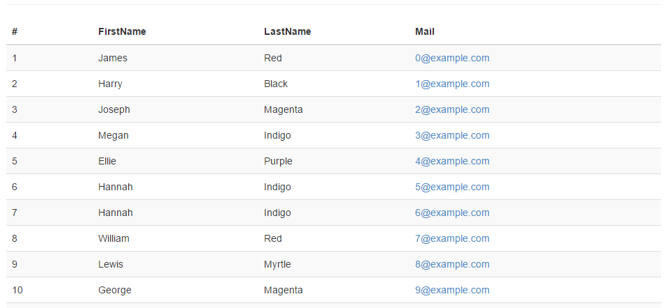

# Optimale Web-Umgebung mit AngularJS und ASP.NET, Teil 2
## Gute Kommunikation

### AngularJS und der Microsoft Web Stack ergänzen sich ideal. Lernen Sie in dieser Artikelreihe eine Auswahl von Patterns und Frameworks kennen, welche Sie bei der Adaption und Integration von AngularJS in Ihre .NET-Anwendung berücksichtigen sollten. 

In einer typischen ASP.NET MVC oder Web Forms Anwendung kann es leicht geschehen, dass eine saubere Trennung von Daten und Layout verloren geht. Setzt man auf eine Single-Page-Anwendung, so hat man die Gelegenheit den Datenfluss zu überdenken und neu zu definieren. Es bietet sich eine Architektur nach dem **Re**presentational **S**tate **T**ransfer (REST [1]) an. Doch hinsichtlich der einzusetzenden Protokolle, Formate und Konventionen bleiben diverse Fragen für die praktische Umsetzung von REST offen. Wie sollen etwa die Query-Parameter heißen? Welchem Format soll eine Antwort genügen? Wie lassen sich die Schnittstellen maschinenlesbar definieren? Microsoft gibt hier mit dem Open Data Protocol (OData) eine ausführliche und standardisierte Antwort.

#### Die Geschäftslogik

In diesem Artikel dient zur Erläuterung dient eine sehr einfache Geschäftslogik auf Basis des Entity Frameworks Version 6. Es wird der "Code First"-Ansatz verwendet. Die vom Entity Framework erzeugten Instanzen sollen auch gleichzeitig die Geschäftsobjekte repräsentieren. Bitte beachten Sie, dass die feste Verdrahtung der Geschäftslogik mit einem Objektrelationen Mapper wie dem Entity Framework für eine größere Anwendung sorgfältig abgewägt sein sollte! Für eine Beispiel-Anwendung ist dies aber kein Problem. Es gibt somit die Entität Kunde, welcher eine beliebige Anzahl an Rechnungen besitzen kann.

##### Listing 1a -- Die "Geschäftslogik"
~~~~~
public class Customer
{
    public Customer()
    {
        Invoices = new List<Invoice>();
    }

    public int Id { get; set; }
    public string FirstName { get; set; }
    public string LastName { get; set; }
    public string Mail { get; set; }
    public DateTime Date { get; set; }
    public ICollection<Invoice> Invoices { get; set; }
}

public class Invoice
{
    public int Id { get; set; }
    public decimal Amount { get; set; } 
}

public class DataContext : DbContext, IDataContext
{
    public DbSet<Customer> Customers { get; set; }
}
~~~~~

#### Daten per Web API abrufen

Als erster Anwendungsfall soll eine Liste von Kunden angezeigt wird. Für diese häufig benötigte Aufgabe existiert sogar ein "Scaffolding" T4-Template in Visual Studio 2013. (Auswahl: "Web API 2 Controller with actions, using Entity Framework")

##### [Abb. 1] Scaffolding in Visual Studio 2013

##### [Abb. 1] Scaffolding in Visual Studio 2013

Visual Studio generiert dabei einen längeren Code, welcher per ASP.NET Web API den Entity Framework-Context zum Erzeugen, Lesen, Ändern und Löschen (CRUD) für die Außenwelt verfügbar macht. In einer an REST orientierten Schnittstelle kann man diese atomaren Operationen mit dem HTTP-Verben POST, GET, PUT und DELETE ausdrücken. Folgender Aufruf gibt etwa eine Liste von Kunden zurück:

~~~~~
GET http://example.org/api/Customers
~~~~~  

Passende dazu zeigt der Ausschnitt aus Listing 1b die von Visual Studio generierte "READ"-Methode.

##### Listing 1b -- Web API Controller per generiertem Code (Ausschnitt)
~~~~~
public class CustomersController : ApiController
{
    private DataContext db = new DataContext();

    // GET: api/Customers
    public IQueryable<Customer> GetCustomers()
    {
        return db.Customers;
    }

    /* [...] */
}
~~~~~

Mit AngularJS  lässt sich dieser Web API Controller über den `$http`-Service aufrufen. Der Service akzeptiert einen String oder ein Konfigurations-Objekt. Der Rückgabewert der Methode ist ein "promise"-Objekt, welches die Methoden (success und error) besitzt. Über diese beiden Methoden lassen Callback für einen erfolgreichen bzw. fehlerhaften Aufruf registrieren. Das Listings 1c zeigt den vollständigen Code, um Daten per `$http` zu landen. 

##### Listing 1c -- AngularJS Controller fragt Daten per GET ab
~~~~~
define(['angular'], function(angular) {

    return angular.module('listing1', [])
        .controller('listing1Controller', [
            '$scope', '$http', function($scope, $http) {

                $scope.customers = [];

                $http.get('/api/Customers').success(function(data) {
                    $scope.customers = data;
                });
            }
        ]);
});
~~~~~ 

Der `define` Befehl wurde im letzten Artikel dieser Reihe erläutert (dotnetpro Ausgabe 01/2015). Mittels require.js werden Abhängigkeiten für das Modul definiert und verwendet. In diesem Fall ist es nur eine einzige Abhängigkeit zu AngularJS. Listing 1c demonstriert, wie die empfangenen Daten mittels `ng-repeat` und dem CSS-Framework Bootstrap [2] tabellarisch dargestellt werden können.

##### Listing 1d -- AngularJS Template rendert Daten als Tabelle
~~~~~

    <table class="table table-striped">
        <thead>
            <tr>
                <th>#</th>
                <th>FirstName</th>
                <th>LastName</th>
                <th>Mail</th>
            </tr>
        </thead>
        <tbody>
            <tr ng-repeat="customer in customers">
                <td ng-bind="customer.Id"></td>
                <td ng-bind="customer.FirstName"></td>
                <td ng-bind="customer.LastName"></td>
                <td></td>
            </tr>
        </tbody>
    </table>

~~~~~ 

##### [Abb. 2] Die Tabelle aus Listing 1d im Bootstrap-Design

#### Verwendung von OData zur Anzeige tabellarischer Daten

So wie der Web API Controller aus Listing 1b implementiert wurde, wird ein Aufruf der Ressource ohne weitere Parameter eine Liste aller Entitäten zurück geben. Es wird hierbei tatsächlich der gesamte Inhalt der Datenbank-Tabelle ausgeben! Je mehr Daten vorhanden sind, desto unpraktikabler wird dieser Ansatz. Es fehlt eine seitenweise Einschränkung der Ergebnismenge. An diesem Punkt stellt sich die Frage, wie die notwendigen Query-Parameter in der URL benannt werden sollten. Man könnte etwa "page" und "pagesize" verwenden. Man könnte sich auch von LINQ inspirieren lassen und auf "skip" und "take" setzen. Man könnte aber auch einen HTTP Range-Header [3] setzen, um die Menge an Entitäten einzuschränken (Erläuterung siehe [4]).

Die Entscheidungsmatrix lässt sich beliebig weiterführen und auf weitere Probleme ausweiten. Klärungsbedarf innerhalb eines Teams sind vorprogrammiert. Eine zähe Entscheidungsfindung lässt sich gänzlich vermeiden, wenn man auf das OData Protokoll setzt. OData gibt die Namen der Parameter exakt vor, so dass die Verwendung eindeutig wird [5]. Die notwendigen Parameter heißen `$top` und `$skip`. `$top` gibt *n* Elemente der Ergebnismenge zurück. `$skip` überspringt *n* Elemente in der Ergebnismenge. Möchte man z.B. die Kunden mit der fortlaufenden Nummer 3 bis 7 abrufen, so verwendet man folgendes Query:

~~~~~
GET http://example.org/odata/Customers?$top=5&$skip=2
~~~~~

Weitere Query-Parameter sind unter anderem `$filter`, `$orderby`, `$count` oder `$search`. Der bestehende Web API Controller kann durch ein paar Änderungen um die Funktionalität von OData ergänzt werden. Der Controller muss hierzu vom ODataController erben. Weiterhin ist es notwendig, das Funktionalität per `[EnableQuery]` explizit freizuschalten.    

##### Listing 2a -- OData Controller (Ausschnitt)
~~~~~
public class CustomersController : ODataController
{
    private DataContext db = new DataContext();

    // GET: odata/Customers
    [EnableQuery]
    public IQueryable<Customer> GetCustomers()
    {
        return db.Customers;
    }

    /* [...] */
}
~~~~~

Anschließend ist es notwendig die Klasse `WebApiConfig` zu konfigurieren. Mittels `config.Routes.MapODataRoute` legt man fest, unter welcher Adresse der "root" des OData Service zu finden ist. Alle Beispiele von Microsoft verwenden die Adresse "/odata", welche sich von der Adresse "/api" für normale ASP.NET Web API Aufrufe unterscheidet. Laut Spezifikation sollte ein OData Service sein Modell im "Common Schema Definition Language" (CSDL) Format offen legen. In jenem CSDL-Dokument ist ein "Entity Data Model" (EDM) beschrieben [6]. Das "Entity Data Model" ist ein alter Bekannter, welcher seit jeher die konzeptionelle Grundlage des Entity Framworks bildet. Es liegt nahe, das bereits existierende Code-First-Modell aus dem Entity Framework wieder zu verwenden. Damit würde man aber das gesamte Datenbanklayout veröffentlichen. Ebenso könnte man den Service nicht mehr um zusätzliche Operationen ergänzen. Es ergibt sich daher die Notwendigkeit, ein zweites, öffentliches Modell zu erstellen. Hierfür verwendet man den ODataConventionModelBuilder. 

##### Listing 2b -- OData konfigurieren
~~~~~
public static class WebApiConfig
{
    public static void Register(HttpConfiguration config)
    {
        ODataConventionModelBuilder builder = new ODataConventionModelBuilder();
        builder.EntitySet<Customer>("Customers");
        builder.EntitySet<Invoice>("Invoices");
        config.Routes.MapODataServiceRoute("odata", "odata", builder.GetEdmModel());
    }
}
~~~~~

Der Controller unterstützt nun eine seitenweise Ausgabe, Sortierung und Filterung. Diese Fähigkeiten direkt mit AngularJS umzusetzen wäre ein großer Aufwand. Es bietet sich an, ein fertiges Tabellen-Control ("Grid") zu verwenden. Hierfür gibt es eine Reihe von freien und proprietären Komponenten, die mit AngularJS kompatibel sind. Listing 2c und Linsting 2d zeigen die Verwendung des Kendo UI Grid von Telerik [7].

##### Listing 2c -- AngularJS Controller konfiguriert die Datenquelle für OData
~~~~~
define(['angular', 'kendo'], function(angular) {

    return angular.module('listing2', ['kendo.directives'])
        .controller('listing2Controller', [
            '$scope', function($scope) {

                $scope.customerDataSource = new kendo.data.DataSource({
                    type: 'odata',
                    transport: {
                        read: {
                            type: 'GET',
                            url: '/odata/Customers',
                            dataType: 'json'
                        }
                    },
                    schema: {
                        data: function (data) { return data.value; },
                        total: function (data) { return data['odata.count']; },
                        model: {
                            id: 'Id',
                            fields: {
                                Id: { type: 'number' },
                                FirstName: { type: 'string' },
                                LastName: { type: 'string' },
                                Mail: { type: 'string' },
                                Date: { type: 'date' }
                            }
                        }
                    },
                    serverPaging: true,
                    serverSorting: true,
                    serverFiltering: true,
                    pageSize: 10
                });
            }
        ]);
});
~~~~~

##### Listing 2d -- Eine AngularJS Direktive wrappt das KendoUI Grid-Control
~~~~~

~~~~~  

##### [Abb. 3] Die Tabelle aus Listing 1d im Bootstrap-Design

Im Kern ist Kendo UI ein Framework, welches aus diversen jQuery-Plugins besteht. Normalerweise ist die Integration von jQuery-Plugins mit etwas Aufwand verbunden. Doch der Hersteller liefert über das AngularJS Modul `kendo.directives` gleich passende Direktiven für AngularJS mit. Bei der Konfiguration der Datenquelle fällt jedoch auf, dass das Modell zur Beschreibung des Kunden erneut deklariert werden muss. Eine Verwendung der OData-Metadaten wurde vom Hersteller nicht implementiert, was etwas schade ist.

#### Die Geschäftslogik per breeze.js besser integrieren 

Ein UI Framework wie Kendo UI legt seinen Fokus auf die diversen UI Controls. Auf welche Art und Weise die Daten über die Leitung kommen, spielt dann eher eine untergeordnete Rolle. OData hat aber das Potential die Entwicklung eigener Funktionalitäten entscheidend zu bereichern. Betrachtet man das Listing 1c erneut, so fallen einige unschöne Tatsachen auf, wenn man sich den GET-Request anschaut.

~~~~~
GET http://localhost:1337/api/CustomersApi HTTP/1.1

~~~~~

 Man muss wissen unter welcher Route die Kunden zu finden sind (hier: "/api/Customers"). Der Controller akzeptiert ein JSON-Array welches keine Bedeutung.       

  
  

##--- TODO ---

#### Infobox: Hinweis zu den verschiedenen OData-Versionen 
Das OData-Protokoll in der Version 4 wurde bereits im Frühjahr 2014 als OASIS Standard bestätigt. Dennoch vollzieht sich die Adaption der neuesten Version bislang noch schleppend. Grund dafür mag sein, dass Microsoft in den letzten Jahren mehrere miteinander inkompatible OData-Spezifikationen veröffentlicht hat. Auch verhielten sich in der Vergangenheit die serverseitigen Implementierungen von OData für Web API und WCF unterschiedlich, was den Sinn einer Spezifikation konterkariert. Den Autoren von Client-Bibliotheken und damit auch den Anwendern wurde das Leben so unnötig schwer gemacht. Das Framework data.js, welches die Grundlage von breeze.js ist, hat noch keine stabile Unterstützung von OData v4. Selbst in Visual Studio hat zum Zeitpunkt des Schreibens hat noch kein "Scaffolding"-Template für OData v4 existiert. Der Menüpunkt "Web API 2 OData Controller with actions, using Entity Framework" erzeugt Code für die Version 3 des OData Protokolls. Verwendet man das Template, so werden ebenso die Nuget-Pakete für das alte Protokoll eingebunden! Da hätte man mehr von Microsoft erwarten können. Immerhin hat Telerik mit dem "November 2014" Release des Kendo UI Framweworks jüngst Support für die neueste Version nachgeliefert. **Um Inkompatibilitäten zu vermeiden, basieren alle Beispiele in diesem Artikel auf der gut etablierten Version 3 von OData.** Sollten Sie sich nicht sicher sein, welche Version ein OData Service implementiert, so lässt sich dies über das Metadaten-Dokument herausfinden (z.B. http://example.org/odata/$metadata).

##### [Abb. x] Das Metadaten-Dokument verrät die verwendete Version von OData 

# Auf einen Blick

**Johannes Hoppe** ist selbstständiger Webdesigner, Softwareentwickler und IT-Berater.

Er realisiert seit mehr als 10 Jahren Software-Projekte für das Web und entwickelt moderne Portale auf Basis von ASP.NET MVC und JavaScript. Seine Arbeit konzentriert sich auf SinglePage-Technologien und NoSQL-Datenbanken. Er unterrichtet als Lehrbeauftragter und schreibt über seine Vorlesungen, Trainings und Vorträge in seinem Blog. (http://blog.johanneshoppe.de/)

[1] Roy Thomas Fielding - REST: http://www.ics.uci.edu/~fielding/pubs/dissertation/top.htm
[2] Bootstrap: http://getbootstrap.com/
[3] HTTP/1.1 (RFC 2616) Abschnitt 14.35.2 - Range Retrieval Requests: http://www.w3.org/Protocols/rfc2616/rfc2616-sec14.html#sec14.35.2
[4] John Gietzen - Range header: http://otac0n.com/blog/2012/11/21/range-header-i-choose-you.html
[5] OData Version 4.0 - URL Conventions - http://docs.oasis-open.org/odata/odata/v4.0/odata-v4.0-part2-url-conventions.html
[6] OData Version 4.0 - CSDL: http://docs.oasis-open.org/odata/odata/v4.0/odata-v4.0-part3-csdl.html
[7] Kendo UI - http://www.telerik.com/kendo-ui1