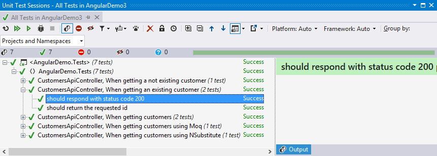
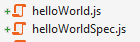
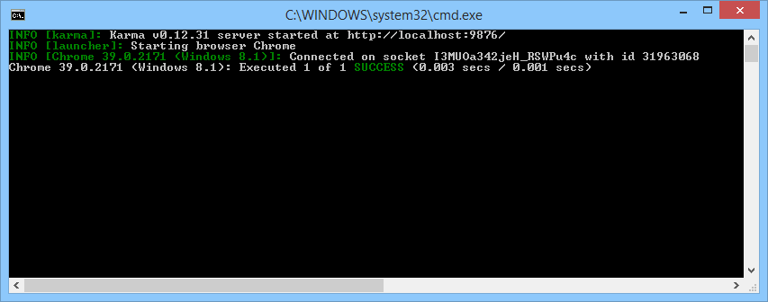
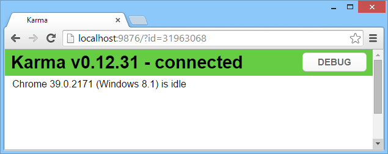

# Optimale Web-Umgebung mit AngularJS und ASP.NET, Teil 3
## Solides Handwerk

### AngularJS und der Microsoft Web Stack ergänzen sich ideal. Lernen Sie in dieser Artikelreihe eine Auswahl von Patterns und Frameworks kennen, welche Sie bei der Adaption und Integration von AngularJS in Ihre .NET-Anwendung berücksichtigen sollten. 

In der ersten Ausgaben dieser Artikelreihe wurden der Modul-Loader require.js vorgestellt. Die zweiten Ausgabe widmete sich dem OData-Protokoll und dem AJAX-Framework breeze.js. Doch waren alle vorgestellten Quellcode-Beispiele tatsächlich fehlerfrei? Es gilt zu beweisen, dass sowohl der C#-Code als auch der JavaScript-Code korrekt implementiert wurde. Dieser Artikel widmet sich daher ganz dem Thema Unit-Testings und zeigt Wege auf, wie sie die Qualität Ihrer Software auf dem Server und auf dem Client sicher stellen können.

#### Code auf Basis des Entity Frameworks testen

In der Ausgabe 02/2015 wurde eine simple Geschäftslogik mit zwei Entitäten eingeführt. Die technische Grundlage bildete das Entity Framework in Version 6 mit dem "Code First"-Ansatz. Das Entity Framework ist ein objektrelationaler Mapper (ORM). Es verbindet die objektorientierte .NET-Welt mit einer relationalen Datenbank wie dem SQL Server. Die vom Entity Framework erzeugten Instanzen repräsentierten auch gleichzeitig die Geschäftsobjekte. Die Geschäftslogik bestand aus der Entität "Kunde", welche eine beliebige Anzahl an Rechnungen besitzen konnte. 

##### Listing 1a -- Die "Geschäftslogik" aus Ausgabe 02/2015
~~~~~
public class Customer
{
    public Customer()
    {
        Invoices = new List<Invoice>();
    }

    public int Id { get; set; }
    public string FirstName { get; set; }
    public string LastName { get; set; }
    public string Mail { get; set; }
    public DateTime DateOfBirth { get; set; }
    public virtual ICollection<Invoice> Invoices { get; set; }
}

public class Invoice
{
    public int Id { get; set; }
    public decimal Amount { get; set; }

    public int CustomerId { get; set; }                     
    public virtual Customer Customer { get; set; } 
}

public class DataContext : DbContext
{
    public virtual DbSet<Customer> Customers { get; set; }
    public virtual DbSet<Invoice> Invoices { get; set; }

    protected override void OnModelCreating(DbModelBuilder modelBuilder)
    {
        modelBuilder.Configurations.Add(new InvoiceMap());
    }
}
~~~~~

Weiterhin wurde ein ASP.NET Web Api Controller verwendet, um eine Liste aller Kunden per REST zur Verfügung zu stellen.  

##### Listing 1b -- Web API Controller aus Ausgabe 02/2015
~~~~~
public class CustomersController : ApiController
{
    private DataContext db = new DataContext();

    // GET: api/Customers
    public IQueryable<Customer> GetCustomers()
    {
        return db.Customers;
    }

    // GET: api/CustomersApi/5
    [ResponseType(typeof(Customer))]
    public IHttpActionResult GetCustomer(int id)
    {
        Customer customer = db.Customers.Find(id);
        if (customer == null)
        {
            return NotFound();
        }

        return Ok(customer);
    }

    /* [...] */
}
~~~~~


#### Unit-Tests mit dem Entity Framework

So wie der `CustomersController` in der letzten Ausgabe vorgestellt wurde, lässt sich dieser nur schwer automatisch Testen. Der Code hat eine fest definierte Abhängigkeit auf den `DataContext`. Durch diese Abhängigkeit kann der Controller nicht mehr losgelöst von allen anderen "Units" getestet werden. Im konkreten Fall würde das Entity Framework stets versuchen, eine Datenbankverbindung aufzubauen. Solange dies der Fall ist, kann ein Unit-Test nicht implementiert werden. Mittels des "Inversion of Control" Prinzips (IoC) lässt sich der Code jedoch schnell korrigieren. Statt eine Instanz vom `DataContext` selbst zu erzeugen, wird diese einfach dem Konstruktor übergeben: 

~~~~~
public class CustomersController : ApiController
{
    private readonly DataContext db;

    public CustomersController(DataContext dataContext)
    {
        db = dataContext;
    }

    /* [...] */
}
~~~~~

Üblicherweise verwendet man einen existierenden IoC-Container, welcher viel Arbeit abnehmen kann. Der Quelltext auf der Heft-CD verwendet das Framework Autofac [1], welches eine komfortable Integration in ASP.NET MVC und ASP.NET Web API bietet (siehe Datei "IocConfig.cs"). Der Controller akzeptiert nun eine beliebige Instanz des Objektes `DataContext`. Weitere Anpassungen sind nicht notwendig, denn erfreulicherweise ist das Entify Framework direkt mit Objekten im Arbeitsspeicher testbar. Für die Version 5 des Entity Frameworks war es noch notwendig, das Objekt mit einem Interface zu maskieren. Seit Version 6 ist kein zusätzliches Interface notwendig, es da alle relevanten Properties von `DbSet<T>` als virtuell markiert wurden. 

Listing 1c demonstriert einen solchen Unit-Test, welcher eine simple Liste verwendet. Der Test soll beweisen, dass tatsächlich alle vorhanden Kunden-Entitäten von der Methode `GetCustomers` berücksichtigt werden. In diesem Beispiel wird das Unit-Test Framework "Machine.Specifications" (MSpec) [2] verwendet. MSpec kann direkt über Nuget bezogen werden. Die Syntax von MSpec ermöglicht gut lesbare Tests im "Behavior-Driven Development" (BDD) Stil. Das Framework unterstützt die gängige Build-Server und integriert sich ebenso in Visual Studio. Benutzer von NCrunch und Resharper können das bestehende Tooling verwenden, für die direkte Verwendung in Visual Studio empfiehlt sich der "MSpec Test Adapter" [3] aus der Visual Stuido Erweiterungsgalerie.  

Das Framework "Fluent Assertions" [4] stellt die Erweiterungs-Methode "Should()" bereit. Als Mocking-Framework wird "NSubstitute" [5] eingesetzt. Den Quelltext zu allen Listings finden Sie auf der Heft-CD sowie zum Download auf der dotnetpro Website:

##### Listing 1c - Ein Unit-Test mit NSubstitute 
```
[Subject(typeof(CustomersController))]
public class When_getting_customers
{
    static CustomersController controller;
    static IQueryable<Customer> result;

    Establish context = () =>
        {
            var data = new List<Customer> 
            { 
                new Customer { FirstName = "Test1" }, 
                new Customer { FirstName = "Test2" } 
            }.AsQueryable();

            var mockSet = Substitute.For<IDbSet<Customer>, DbSet<Customer>>();
            mockSet.Provider.Returns(data.Provider);
            mockSet.Expression.Returns(data.Expression);
            mockSet.ElementType.Returns(data.ElementType);
            mockSet.GetEnumerator().Returns(data.GetEnumerator());

            var mockContext = Substitute.For<DataContext>();
            mockContext.Customers.Returns(mockSet);

            controller = new CustomersController(mockContext);
        };

    Because of = () => result = controller.GetCustomers();

    It should_return_all_customers = () => result.Count().Should().Be(2);
}
``` 


#### Integrationstests mit dem Entity Framework

Die Verwendung einer ganz normalen "In-Memory"-Liste hilft dabei, mit einfachen Mitteln schnell eine hohe Testabdeckung zu erreichen. Leider wird bei "In-Memory"-Daten der "LINQ to Objects" Provider verwendet, welcher sich vom "LINQ to Entities" Provider für echte Datenbankoperationen unterscheidet. Die Limitation bei "In-Memory"-Daten beschreibt Microsoft unter anderem in einem ausführlichen Artikel [6]. 

Testet man Code, welcher mit einer Datenbank interagiert, so spricht man von einem Integrationstest. In der Regel sind Integrationstests verhältnismäßig langsam und fehleranfällig. Andererseits sind Sie unverzichtbar, denn nur ein Test gegen eine echte Datenbank stellt sicher, das alle Feinheiten des Ziel-Datenbanksystems berücksichtigt wurden. Idealerweise lässt man Integrationstests regelmäßig automatisch laufen (zum Beispiel einmal Nachts) und verwendet während der Entwicklung bevorzugt Unit-Tests. 

Neben den beiden üblichen Vorgehensweisen (Integrationstests oder Unit-Tests im Arbeitsspeicher) gibt es einen Zwischenweg. Das Framework "Effort" [7] verwendet eine eigene In-Memory Datenbank und emuliert einen relationalen Datenbankserver. Das Verhalten des Entity Frameworks entspricht nun weitgehend dem Verhalten, welches bei der Verwendung des Microsoft SQL Server gegeben wäre. Man muss aber beachten, dass Stored Procedures, Views und Trigger nicht unterstützt werden. Dies muss aber kein Problem darstellen. Gerade Stored Procedures werden häufig gescholten, da sie Logik in der Datenbank verlagern. Ähnlich verhält es sich mit Views und Trigger. Ändert man die Logik auf der Datenbank ab, so kann dies Einfluss auf das Laufzeitverhalten des Codes haben. Sind Datenbank und Code nicht mehr synchron, ist auch das Verhalten der Anwendung nicht mehr deterministisch. Sofern man die Wahl hat, sollte man daher dem Entity Framework (oder einem anderen ORM) eine führende Rolle überlassen und Stored Procedures, Views und Trigger gar nicht erst verwenden.

Für den "Code First"-Ansatz stellt Effort die `DbConnectionFactory` zur Verfügung. Hiermit lässt sich eine komplett isolierte In-Memory Datenbank erstellen, welche nach der Verwendung wieder verworfen wird. Der Befehl hierfür lautet:

```
DbConnection connection = Effort.DbConnectionFactory.CreateTransient();
````

Nun muss der `DataContext` noch um einen weiteren Konstruktor ergänzt werden, damit dieser die gefälschte Datenbankverbindung akzeptiert:

```
public class DataContext : DbContext
{
    public DataContext() { }
    public DataContext(DbConnection connection) : base(connection, true) { }

    /* [...] */
}
``` 

Das Listing Nr. 2 demonstriert die Verwendung von Effort anhand des CustomersController. Wie man an der zweiten Behauptungen erkennen kann, werden auch Primärschlüssel korrekt inkrementiert - was bei der Verwendung einer Liste nicht funktionieren würde. 

##### Listing 2 - Ein leichtgewichtiger Integrationstest mit Effort 
~~~~~
[Subject(typeof(CustomersController))]
public class When_getting_customers
{
    static CustomersController controller;
    static IQueryable<Customer> result;

    Establish context = () =>
        {
            DbConnection connection = Effort.DbConnectionFactory.CreateTransient();
            DataContext context = new DataContext(connection);
            controller = new CustomersController(context);

            Customer customer1 = new Customer { FirstName = "Test1" };
            Customer customer2 = new Customer { FirstName = "Test2" };

            context.Customers.AddRange(new[] {customer1, customer2});
            context.SaveChanges();
        };

    Because of = () => { result = controller.GetCustomers(); };

    It should_return_all_customers = () => result.Count().Should().Be(2);
    It should_increment_primary_keys = () => result.First().Id.Should().Be(1);
}
~~~~~


#### Den Vertrag der Web API einhalten

Zwischen Client und Server existiert es immer einen Vertrag, der die Kommunikation regelt. Bei einer REST-basierten Anwendung kann dieser Vertrag kann maschinenlesbar beschrieben werden, etwa mit OData, WADL oder HATEOAS. Oft wird der Vertrag aber auch einfach durch Konventionen oder eine API-Dokumentation ausgedrückt. Auf jeden Fall sollte man die Einhaltung des Vertrages durch automatische Tests garantieren. Es wäre zum Beispiel sehr ärgerlich, wenn durch eine Code-Änderung das Verhalten der zweiten `GetCustomer`-Methode aus Listing 1b unerwartet geändert werden würde. Im Programmier-Alltag geschieht es schnell, dass ein Programmierer die Intention eines anderen Programmierers nicht mehr berücksichtigt und damit einen schwer zu lokalisierenden Bug einführt. Folgender Test stellen sicher, dass die `GetCustomer`-Methode entweder mit dem Statuscode 200 bzw. 404 antwortet:

##### Listing 3 - ASP.NET Web API Controller testen 
~~~~~    
public class SetupCustomersApiController
{
    public static CustomersApiController controller;
    public static IHttpActionResult result;

    Establish context = () =>
    {
        DbConnection connection = Effort.DbConnectionFactory.CreateTransient();
        DataContext context = new DataContext(connection);
        controller = new CustomersApiController(context);

        Customer customer = new Customer { FirstName = "Test" };

        context.Customers.Add(customer);
        context.SaveChanges();
    };
}

[Subject(typeof(CustomersApiController))]
public class When_getting_an_existing_customer : SetupCustomersApiController
{
    Because of = () => result = controller.GetCustomer(1);

    It should_respond_with_status_code_200 = () => result.Should().BeOfType<OkNegotiatedContentResult<Customer>>();
    It should_return_the_requested_id = () => ((OkNegotiatedContentResult<Customer>)result).Content.Id.Should().Be(1);
}

[Subject(typeof(CustomersApiController))]
public class When_getting_a_not_existing_customer : SetupCustomersApiController
{
    Because of = () => result = controller.GetCustomer(2);

    It should_respond_with_status_code_404 = () => result.Should().BeOfType<NotFoundResult>();
}   
~~~~~

Der Lohn für all die Mühen wird ein "grüne" Testsuite sein:


##### [Abb. 1] Erfolgreiche Tests im Unit Test Runner des ReSharper  


#### JavaScript-Code mit Karma und Jasmine testen

Diese und weitere Tests verbessern die Qualität des C#-Sourcecode. Die Tests beweisen, dass die Software das tut, wofür sie konzipiert wurde. Ebenso dokumentieren die Tests fachliches Wissen und den Erkenntnisstand eines Entwicklers, den er zum Zeitpunkt der Erstellung hatte. Wenn man als Entwickler das existierende Wissen nicht durch Tests ausdrückt, ist die Wahrscheinlichkeit sehr hoch, dass das Wissen über die Zeit für einen selbst, für das Team und für das Unternehmen verloren geht. Dies gilt auch für den Client-seitigen Code. Die Verwendung AngularJS erweist sich hierbei als großer Vorteil, da das Framework speziell darauf ausgerichtet wurde, gut testbare Module zu ermöglichen.

Um Unit-Tests für Anwendungen auf Basis von AngularJS zu schreiben, verwendet man am Besten einen so genannten Test-Runner. Empfehlenswert ist der Test-Runner "Karma", welcher zusammen mit AngularJS von Google entwickelt wurde. Das Tool basiert auf Node.js 
und läuft somit auf allen gängigen Betriebssystemen. Erwähnenswert ist die Tatsache, dass Karma einen eigenen Webserver startet und dann einen echten Browser (z.B. den Internet Explorer, Firefox und Chrome) die JavaScript-Dateien ausführen lässt. Der eigene Webserver zeichnet Karma aus und vermeidet technische Probleme, die man bei der Ausführung per lokalem Dateisystem hätte. 

Die Installation von Karma ist sehr einfach. Es ist zunächst notwendig, Node.js [8] zu installieren damit der Befehl "npm" befehlt zur Verfügung steht. Man kann, wie auf der Website von Karma beschrieben, den Test-Runner und alle Plugins per Kommandozeilenbefehl installieren. Komfortabler und vor allem reproduzierbarer ist es jedoch, eine Datei namens `package.json` in das gewünschte Verzeichnis zu legen. Danach lassen such durch den Befehl `npm install` alle notwendigen Dateien herunter laden:

##### Listing 4a - package.json zur Installation von Karma 
~~~~~
{
    "name" : "karma-testrunner-and-depedencies",
    "version" : "1.0.0",
    "description" : "Installs Karma Testrunner and dependencies",
    "dependencies" : {
        "karma": "~0.12.31",
        "karma-jasmine": "~0.3.3",
        "jasmine-core": "~2.1.3",
        "karma-requirejs": "~0.2.2",
        "karma-chrome-launcher": "~0.1.4",
        "karma-cli": "~0.0.4"
    },
    "private": true
}
~~~~~

Anschließend benötigt das Projekt eine Konfigurationsdatei, welche den standardmäßig Namen `karma.conf.js` trägt. Der Befehl `karma init` startet ein Kommandozeilen-Dialog, welcher bei der Erstellung der Datei hilft. In den letzten beiden Artikeln der Serie wurden alle JavaScript-Dateien im AMD-Format definiert, entsprechend ist das Plugin `karma-requirejs` zum Laden der Dateien notwendig. Durch die Verwendung von require.js benötigt man lediglich eine spezielle Konfigurations-Datei, welche hier `require.config.karma.js` genannt wird.

##### Listing 4b - karma.conf.js zur Konfiguration von Karma 
~~~~~
module.exports = function(config) {
    config.set({

        basePath: 'AngularDemo/Scripts',
        frameworks: ['jasmine', 'requirejs'],
        files: [
            'require.config.karma.js',
            { pattern: '**/*.js', included: false }
        ],
        browsers: ['Chrome']
    });
};
~~~~~

In der Ausgabe 01/2015 wurde die Datei `require.config.js` vorgestellt. Mit der Datei werden vor allem Pfade und so genannte "Shims" für die Abwärtskompatibel festgelegt. Die Datei `require.config.karma.js` ist notwendig, da nicht alle Einstellungen von der Datei `require.config.js` übernommen werden können. Während zum Beispiel der Standardpfad für JavasScript-Dateien in einer ASP.NET MVC Anwendung `/Scripts` lautet, wird in der Karma-Welt stets der Ordner `/base` verwendet (siehe `baseUrl`).   

##### Listing 4c - require.config.karma.js zur Konfiguration von require.js 
~~~~~
requirejs.config({
    
    baseUrl: '/base', // statt '/Scripts'
    paths: { /* [...] */ },
    shim: { /* [...] */ },
    deps: (function() {

        var allTestFiles = [];

        Object.keys(window.__karma__.files).forEach(function(file) {
          if (/Spec\.js$/.test(file)) {
            allTestFiles.push(file.replace(/^\/base\//, '').replace(/\.js$/, ''));
          }
        });
            
        return allTestFiles;
    })(),
    callback: window.__karma__.start
});
~~~~~

Es bietet sich an, eine Konvention für die Dateinamen der Test-Dateien zu verwenden. Wenn das zu testende AMD-Modul `helloWorld` heißt, so sollte man am Besten das Modul für den Unit-Test `helloWorldSpec` zu nennen:


##### [Abb. 2] Konvention für die Benennung der Test-Module


Da der Name des AMD-Moduls und der Dateiname (ohne Dateiendung) gleich sind, kann man die globale Variable `window.__karma__.files` nach Einträgen mit der Endung "Spec.js" durchsuchen, die Dateiendung entfernen und anschließend alle Module per require.js laden. Dies geschieht in der Funktion die beim Konfigurations-Eintrag `deps` angegeben wurde.      

Es fehlt noch ein Test-Framework, welches idealerweise eine vergleichbare BDD-Syntax wie MSpec besitzt. Diese Syntax bietet das Test-Framework Jasmine [10]. Das folgende Listing definiert einen Test, welcher das simple AMD-Modul `helloWorld` testet:

##### Listing 4d - helloWorld.js mit dem AMD-Modul "helloWorld"
~~~~~
define([], function () {

    return {
        say: function() {
            return "Hello World";
        }
    }
});
~~~~~ 


##### Listing 4e - helloWorldSpec.js mit dem AMD-Modul "helloWorldSpec"
~~~~~
define(['helloWorld'], function(helloWorld) {

    describe('helloWorld', function () {
        it('should say hello', function() {
            expect(helloWorld.say()).toEqual("Hello World");
        });
    });

});
~~~~~ 

Der `define`-Befehle kennzeichnet das AMD-Format. Der Test selbst lädt das zu testende Modul als Abhängigkeit nach. Neu sind die Befehle "describe", "it", "expect" und "beforeEach" welche von Jasmine gestellt werden. Mittels des Befehls `karma start` lässt sich nun dieser erste JavaScript Unit-Test ausführen. Das Ergebnis des Unit-Tests wird auf der Kommandozeile ausgegeben. Es öffnet sich ebenso ein Browser, der die Entwicklung und die Fehlersuche in einem Test in einer gewohnten Debugging-Umgebung ermöglicht.  



##### [Abb. 4] Ein erfolgreicher Test mit dem Karma-Testrunner


#### Den Vertrag im Client einhalten

Ein Unit-Test definiert auf Server-Seite, dass die GET-Methode des CustomerController entweder mit dem Statuscode 200 oder 404 antwortet. Diese Regel sollte auch der Client berücksichtigen, was man idealerweise per Unit-Test sicherstellt.

AngularJS wird mit der Datei "angular-mocks" ausgeliefert, welches das Angular-Modul "ngMock" behinhaltet. Es vereinfacht die Arbeit mit Unit-Tests beträchtlich. Wird ein Test mit Jasmine oder Mocha ausgeführt, so tauscht es unter  anderem den originalen `$httpBackend`-Service von AngularJS mit einem Mock aus. Ebenso kann man mittels des `module` Befehls eigene AngularJS-Module für den Unit-Test vorbereiten. Im nächsten Beispiel wird das Modul `example1` vorbereitet und anschließend auf die beiden Testfälle geprüft.  

##### Listing 5 - customerDetailsControllerSpec.js
~~~~~
define([
    'angular',
    'angular-mocks',
    'app/example1/customerDetailsController'
], function () {

    describe('customerDetailsController', function () {

        var $scope, customerDetailsController;

        // set up the module
        beforeEach(module('example1'));

        beforeEach(inject(function ($rootScope, $controller) {

            $scope = $rootScope.$new();

            customerDetailsController = $controller('customerDetailsController', {
                '$scope': $scope,
                '$routeParams': { customerId: 42 }
            });
        }));

        it('should store received data on HTTP 200', inject(function ($httpBackend) {

            $httpBackend.whenGET("/api/CustomersApi/42").respond({ Id: 42 });
            $httpBackend.flush();

            expect($scope.customer).toBeDefined();
        }));

        it('should indicate an internal server error', inject(function ($httpBackend) {

            $httpBackend.whenGET("/api/CustomersApi/42").respond(404);
            $httpBackend.flush();

            expect($scope.errorMessage).toBeDefined();
        }));

    });
});
~~~~~ 

Das "Inversion of Control"-Prinzip bzw. das "Dependency Injection"-Prinzip ist in AngularJS tief verankert. Das komplette AngularJS-Framework sowie eigener Anwendungscode werden mit dem selben IoC-Container verwaltet. Dadurch ist es problemlos möglich, Teile von AngularJS als auch eigenen Code für die Tests nach Belieben mit Mock-Objekten auszutauschen. Um registrierte Objekte über ihren Namen aus dem IoC-Container aufzulösen, verwendet man den Befehl `inject``.   


Mittels Dependency Injection Mittels des `inject`-Befehls

<hr>


# Auf einen Blick

**Johannes Hoppe** ist selbstständiger Webdesigner, Softwareentwickler und IT-Berater.

Er realisiert seit mehr als 10 Jahren Software-Projekte für das Web und entwickelt moderne Portale auf Basis von ASP.NET MVC und JavaScript. Seine Arbeit konzentriert sich auf SinglePage-Technologien und NoSQL-Datenbanken. Er unterrichtet als Lehrbeauftragter und schreibt über seine Vorlesungen, Trainings und Vorträge in seinem Blog. (http://blog.johanneshoppe.de/)

<hr>

[1] Autofac: http://autofac.org/
[2] MSpec: https://github.com/machine/machine.specification
[3] MSpec Test Adapter: https://visualstudiogallery.msdn.microsoft.com/4abcb54b-53b5-4c44-877f-0397556c5c44
[4] Fluent Assertions: http://www.fluentassertions.com/
[5] NSubstitute: http://nsubstitute.github.io/
[6] MSDN - Testing with a mocking framework (EF6 onwards): http://msdn.microsoft.com/en-us/data/dn314429.aspx
[7] Effort: https://effort.codeplex.com/
[8] Node.js: http://nodejs.org/
[9] Karma Installation: http://karma-runner.github.io/0.12/intro/installation.html
[10] Jasmine: http://jasmine.github.io/